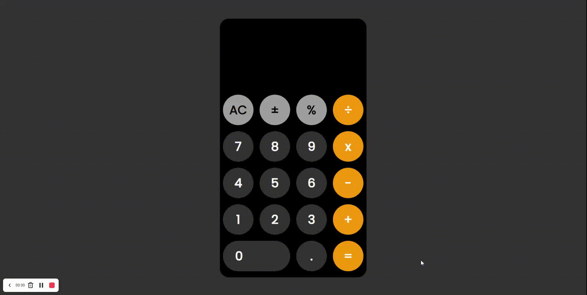

# Ios-Calculator

## Welcome! 👋

Thanks to visit my Github! In this project, i used grid. This project is created with HTML, CSS and JavaScript. Here is the link for this project (https://omer-cicek.github.io/Ios-Calculator/)

**To do this project, i used basic HTML, CSS and JavaScript.**

## The challenge

Users should be able to:

- Calculate mathematical problems

## Got feedback for me?

Feedbacks are always improve my technical knowledge, so feel free to give me a feedback through my LinkedIn account (https://www.linkedin.com/in/omercicek97/) 🙌

**That Is What I Did!** 🚀
